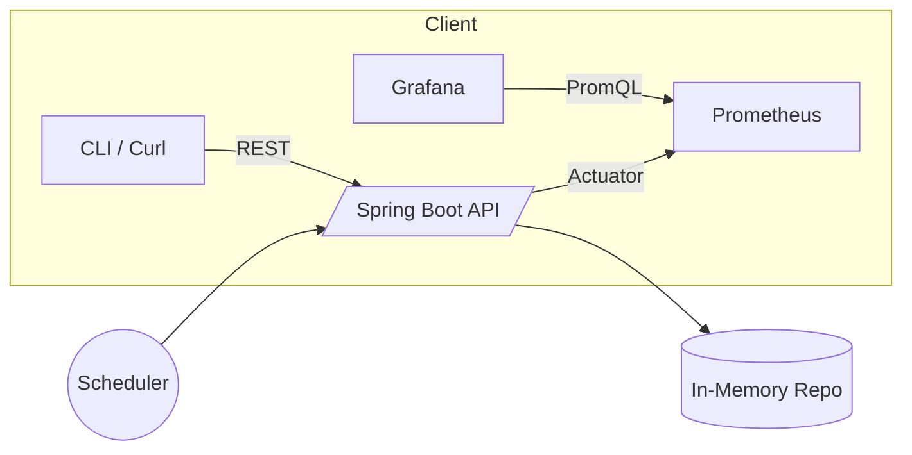

# Distributed Device Fleet Monitor (Mini Netflix Open Connect)

A tiny Spring Boot service that **simulates a fleet of CDN edge appliances**. It exposes:
- REST APIs to list/update devices
- **Prometheus** metrics via Spring Boot Actuator for fleet health
- A scheduler that randomly changes device status to mimic real-world drift

This is a fast, public work sample designed to demonstrate **cloud-native service design, observability, and distributed fleet orchestration** — aligned with Netflix Open Connect’s themes.

## Quick Start
```bash
# Build & run
mvn clean spring-boot:run
# API
curl http://localhost:8080/api/devices | jq
curl http://localhost:8080/api/devices/edge-1 | jq

# Metrics
curl http://localhost:8080/actuator/prometheus
```

## Interesting Metrics (PromQL-ready)
- `cdn_devices_total`
- `cdn_devices_online`
- `cdn_devices_offline`
- `cdn_devices_avg_cpu`
- `cdn_devices_avg_throughput_mbps`

> These map to `cdn.devices.*` gauges (Micrometer will convert dots to underscores for Prometheus).

## Sample Prometheus config
Create `prometheus.yml`:
```yaml
global:
  scrape_interval: 15s

scrape_configs:
  - job_name: "cdn-monitor"
    static_configs:
      - targets: ["host.docker.internal:8080"]
        labels:
          instance: "local"
    metrics_path: /actuator/prometheus
```

## Optional: Docker
```Dockerfile
FROM eclipse-temurin:17-jre
ARG JAR=target/cdn-monitor-0.0.1-SNAPSHOT.jar
COPY ${JAR} app.jar
ENTRYPOINT ["java","-jar","/app.jar"]
```

## Architecture (Mermaid)


## Endpoints
- `GET /api/devices` — list all devices
- `GET /api/devices/{id}` — get a single device
- `POST /api/devices` — upsert a device
- `GET /actuator/prometheus` — metrics for Prometheus

## Notes
- In-memory store (simple & demo-friendly). Swap with a DB for persistence.
- Scheduler randomizes CPU, throughput, and up/down state every 30s.
- Add Grafana dashboard panels for the listed metrics.
```

